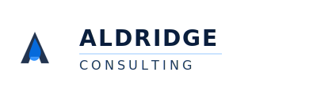

# Aldridge Consulting Logo Usage Guide

## Logo Files Created

### 1. **logo.svg** - Icon Only (Dark Version)
- **Size**: 200x200px
- **Use cases**:
  - Website favicon
  - App icons
  - Small footers
  - Social media profile pictures
- **Background**: Works best on light/white backgrounds

### 2. **logo-white.svg** - Icon Only (Light Version)
- **Size**: 200x200px
- **Use cases**:
  - Dark mode interfaces
  - Dark backgrounds
  - Night mode applications
  - Reverse contrast situations
- **Background**: Works best on dark backgrounds

### 3. **logo-full.svg** - Full Logo with Text (Dark Version)
- **Size**: 400x120px
- **Contains**: Icon + "ALDRIDGE" + "CONSULTING" text
- **Use cases**:
  - Email signatures
  - Business cards (digital)
  - Website headers
  - Letterheads
  - Presentations (light backgrounds)
  - Marketing materials

### 4. **logo-full-white.svg** - Full Logo with Text (Light Version)
- **Size**: 400x120px
- **Contains**: Icon + "ALDRIDGE" + "CONSULTING" text (white)
- **Use cases**:
  - Dark mode presentations
  - Video overlays
  - Dark backgrounds
  - Night mode marketing materials

## Logo Design Elements

### Color Palette
- **Primary Dark**: `#0A1E3D` (Navy)
- **Primary Blue**: `#007AFF` (Apple Blue)
- **White**: `#FFFFFF`
- **Light Gray**: `#B0C4DE` (Used for subtle details)

### Design Components
1. **Triangular "A" Shape**: Represents the letter "A" in Aldridge with clean, modern lines
2. **Swoosh Element**: Dynamic wave inside the triangle symbolizing innovation and flow
3. **Outline**: Subtle stroke for definition and depth

## Usage Guidelines

### Minimum Size
- Icon only: Minimum 24x24px (for clarity)
- Full logo: Minimum 200x60px (for text legibility)

### Clear Space
- Maintain at least 0.5x the icon height as clear space around the logo
- Don't crowd with other elements

### Color Variations
- **On Light Backgrounds**: Use `logo.svg` or `logo-full.svg`
- **On Dark Backgrounds**: Use `logo-white.svg` or `logo-full-white.svg`
- **On Brand Blue (#007AFF)**: Use white version with adjusted opacity if needed

### Don'ts
- ❌ Don't stretch or distort the logo
- ❌ Don't change colors (use provided versions)
- ❌ Don't add drop shadows or effects
- ❌ Don't rotate the logo
- ❌ Don't use on busy backgrounds without sufficient contrast

## File Formats

All logos are provided in **SVG format** because:
- ✅ **Scalable**: Perfect at any size without quality loss
- ✅ **Small file size**: Fast loading on websites
- ✅ **Editable**: Can be opened in Adobe Illustrator, Figma, etc.
- ✅ **Web-friendly**: Native browser support

### Converting to Other Formats

If you need PNG or other formats:

1. **Online converters**:
   - CloudConvert.com
   - Convertio.co

2. **Design software**:
   - Open SVG in Figma/Illustrator
   - Export as PNG at desired resolution (recommended: 2x or 3x for retina displays)

3. **Recommended PNG exports**:
   - Favicon: 512x512px, 256x256px, 128x128px, 64x64px, 32x32px
   - Social media: 1200x1200px (square)
   - Email signature: 600x180px (full logo)

## Website Integration

The logo has been integrated into:
- ✅ Navbar (top of page)
- ✅ Footer
- ✅ Favicon (browser tab icon)

## Business Applications

### Email Signature
Use `logo-full.svg` (convert to PNG if email client doesn't support SVG):
```html

```

### Business Cards
- **Print**: Export `logo-full.svg` to high-res PNG or PDF (300 DPI minimum)
- **Digital**: Use SVG as-is

### Social Media Profile Pictures
- Export `logo.svg` to PNG at 1200x1200px
- Platforms: LinkedIn, Twitter, Facebook, Instagram

### Letterhead
- Use `logo-full.svg` in top left corner
- Recommended size: 250px wide

## Technical Specifications

### SVG Structure
- ViewBox optimized for scaling
- Clean paths with no unnecessary nodes
- Opacity layers for depth
- Stroke outlines for definition

### Accessibility
- All logos include proper semantic structure
- High contrast ratios maintained
- Works with screen readers when properly implemented

## Questions?

For logo customization or additional formats, contact:
- **Email**: info@aldridge-con.com
- **Phone**: +61 468 086 748

---

**Last Updated**: January 2025
**Version**: 1.0
**Created by**: Claude Code (Anthropic)
